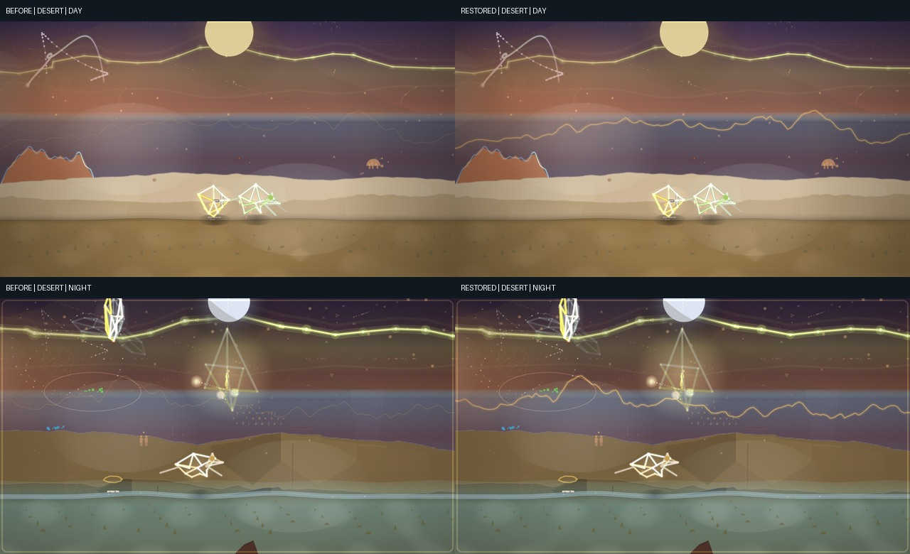

# Dancing Ridge — bring the musical horizon back into the light

The reported frame shows a bright upper SpaceRidge and a barely legible Dancing Ridge in the middle distance. The two lines have separate painters. The musical horizon's contour was already present and correctly positioned, but its two strokes multiplied small alpha values by the scene budget. In subdued sections the crest lost most of its contrast, despite remaining geometrically unobstructed.

`BiomeManager._drawHorizonEQ` now gives the contour a clear, narrow crest and a contained halo. The crest keeps its presence through low-budget moments; the halo breathes with the seven smoothed audio bands. Reduced-flash mode suppresses the animated halo while retaining a readable contour. The existing opening fade and visual-style horizon dial still control the whole effect. No ridge points, mountain layers, ground, or SpaceRidge paint changed.

The comparison uses the same deterministic generated 96-second audio fixture, seed 315, DESERT range, 1280 × 720 viewport, and captures at 20 seconds (day) and 68 seconds (night). The baseline is `main` at `5b6a567`; the improved renders use this branch's working source. Only the horizon-painter source hash differs in the browser capture reports. Pixel differences above a tolerance of 5 lie in the sky around the musical contour (day y=247–363, night y=213–342); the ground region from y=560 down is pixel-identical. In both versions, sampled horizon and L2 visibility fractions are 1.0, confirming this is a paint contrast repair rather than a geometry or occlusion change.

The exact song and playback timestamp in the user-provided screenshot were not available as a reproducible local fixture. These captures test the relevant visual state on a generated song, and the attached screenshot remains outside the repository. A still cannot establish the quality of the audio response throughout playback.

Validation: three focused painter regressions cover dim-scene contrast, bounded glow, audio-responsive halo, reduced-flash behavior, opening fade, and a visible crest at zero decorative budget. In the DESERT browser cases, the ridge remains visible at the lowest quality level (6) and with reduced flashes enabled; each has a sampled horizon visibility fraction of 1.0 and no page errors. `npm test`, `npm run lint`, `npm run stage:site`, and `git diff --check` were run on this change.
