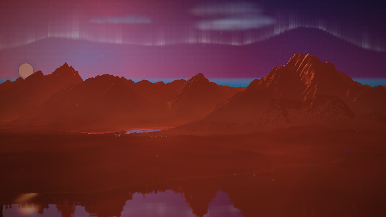
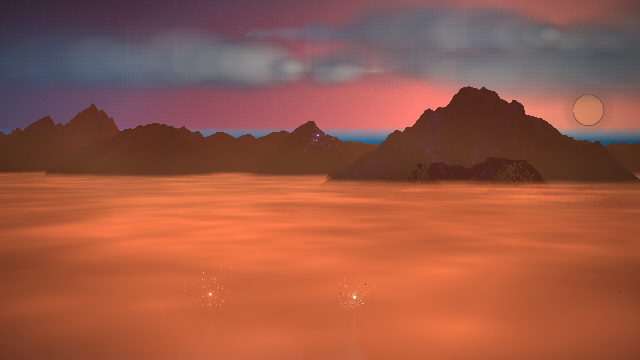

# Sunset, moonlight and sunrise with persistent stars

Each known song starts with a low sunset, spends its middle under moonlight,
and ends at a low sunrise. Twilight occupies the first and last 15%; the moon
crosses the sky during the middle 70%. There is no full daytime passage. The
ending holds at sunrise, and seeking reconstructs the same light and sky.
Unknown durations retain the repeating lunar arc until the ending is known.

The Range's narrative sky returned after its gradient, bypassing the star
catalogue. It now paints that catalogue before the aurora, moon, clouds and
terrain. Stars also stay present during quiet openings. A separate storm
overlay transmitted only 2.8% of the upper sky's light; its cloud banks now
sit lower, leaving the upper night sky visible while rain veils distant land.

The regression test exercises the actual narrative sky path with the generated
catalogue, requiring more than 3,000 star points across the sky throughout the
moon cycle, including low quality and zero opening gain.

| Sunset — 1 s | Moonlight — 30 s | Sunrise — 59.5 s |
| --- | --- | --- |
|  |  |  |

Compare the same seeded song and view [before these changes](../moon-cycle/README.md).
[Capture results](summary.json) include lighting, renderer state, source hashes,
and measured storm transmission. The pixel probe requires over 60% upper-sky
transmission while the rainy horizon remains below 50%.

Clock tests cover short and long songs, sunset/sunrise colors and light
anchors, the moonlit middle, and continuity through the dawn phase wrap.
The production manager tests both v2 and legacy presentation paths.

Validation: 3,917 tests passed; lint passed. Independent review found no
actionable issues. Browser evidence uses synthetic audio at 640×360 in Chromium
software WebGL; it does not measure hardware performance.

Reproduce with the app served on port 8092:

```
PLAYWRIGHT_CHROMIUM_PATH=/usr/bin/chromium node tools/moon-cycle-evidence.mjs
```
