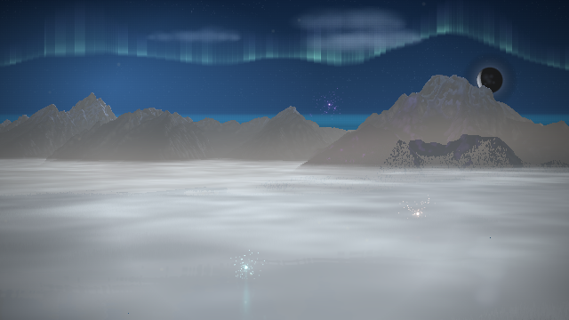
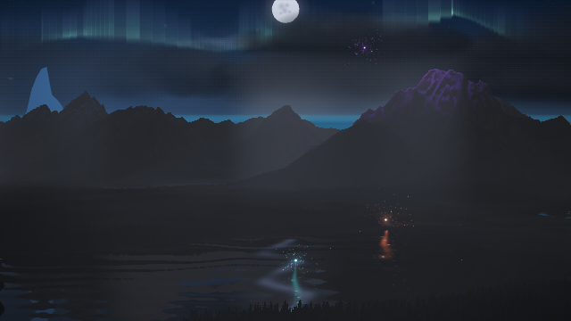
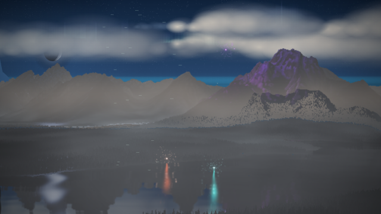

# Persistent Range stars

The Range's narrative sky returned after its gradient, bypassing the star
catalogue. It now paints that catalogue before the aurora, moon, clouds and
terrain. Stars also stay present during quiet openings. A separate storm
overlay transmitted only 2.8% of the upper sky's light; its cloud banks now
sit lower, leaving the upper night sky visible while rain veils distant land.

The regression test exercises the actual narrative sky path with the generated
catalogue, requiring more than 3,000 star points across the sky throughout the
moon cycle, including low quality and zero opening gain.

| Moonrise — 12 s | Storm — 30 s | Moonset — 48 s |
| --- | --- | --- |
|  |  |  |

Compare the same seeded song and view [before this fix](../moon-cycle/README.md).
[Capture results](summary.json) include lighting, renderer state, source hashes,
and measured storm transmission. The pixel probe requires over 60% upper-sky
transmission while the rainy horizon remains below 50%.

Validation: 3,917 tests passed; lint passed. Independent review found no
actionable issues. Browser evidence uses synthetic audio at 640×360 in Chromium
software WebGL; it does not measure hardware performance.

Reproduce with the app served on port 8092:

```
PLAYWRIGHT_CHROMIUM_PATH=/usr/bin/chromium node tools/moon-cycle-evidence.mjs
```
