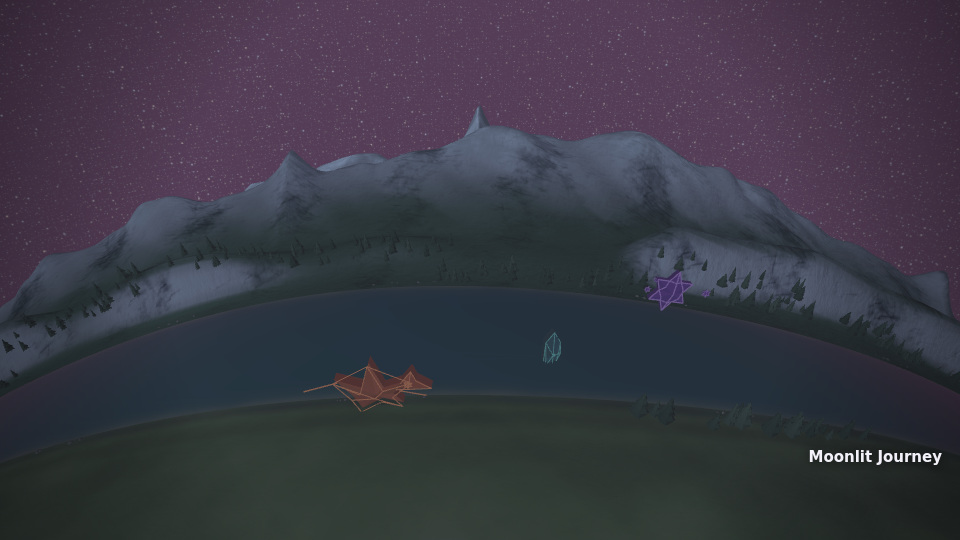

# Journey landscape render proof

Actual application captures of the rebuilt spherical landscape. This package records rendering and behavior checks; visual quality remains for review.



- [Landscape arrival at 22 seconds](landscape-22000ms.jpg).
- Portrait views: [9 seconds](portrait-9000ms.jpg), [22 seconds](portrait-22000ms.jpg).
- [Landscape motion sample](landscape-motion.mp4): one uninterrupted export clock from 9–19 seconds, 121 frames at 12 fps. Including both endpoints gives a 10.083-second encoded clip. The clip has no audio.
- [Compact report](report.json): source and artifact hashes, every movie frame's time/camera/status, resource counters, selected still metadata, and lifecycle results.

The final 9-second frames show the shore, lake, mountains, and trio in the actual landscape/portrait scene framing. The 22-second arrival stays centered on the route with a modest camera retreat. HUD is disabled; scene-native captions and normal application effects remain. Raw screenshots every two seconds and full reports remain in `/workspace/scratch/bb59e08d35c7/journey-evidence/rebuild-proof/final`.

Known visual limits remain: water is relatively uniform and matte, reflecting the sky without a terrain mirror; characters retain their geometric design; foreground detail is sparse. This proof does not establish final visual quality or performance on a user's GPU.

## Checks and source

The final preview saved two 22-second frames; the motion run saved 121 continuous landscape frames and six portrait stills. All passed active Journey rendering, backing dimensions, usable scene aspect, and fixed-clock checks. No page/shader errors or source changes were recorded. Separate lifecycle evidence passed CPU reverse-seek/reduced-motion sampling, real unpinned and matched-input transport seek, actual WebGL loss/recovery, and circumference seam rendering. These compare sampled state/cast/camera, without asserting whole-canvas pixel identity.

Capture commit: `5a2ff0bef228eba5107aef6551973fed6dc797be`. [Published source](https://github.com/aepler315/Midio-5/tree/e7f962a4d7527151d6d2cad0e4855cff5864408a) has the identical tree `b3a1513a54d259166d37f215173561d30809aea0`. All 324 served source hashes match across preview, motion, and lifecycle runs and were verified against the checkout. The integration owner reported 3953 tests: 3948 passed, 0 failed, 5 skipped; lint and site staging passed.

The deterministic 60-second, 112 BPM synthetic pilot uses seed 2917029651. Chromium 153.0.8010.0 rendered through SwiftShader. Counters peaked at 25 draw calls and 836265 triangles; the application graphics ledger estimated 107055810 bytes within a 268435456-byte budget, with zero denials/overcommits. Ledger values estimate residency. Capture timings include offline software rendering, settling, and readback; hardware frame rate and real-time playback performance remain unmeasured.

## Minimal reproduction

From the repository root, with the pilot and a compatible Chromium available:

```sh
PLAYWRIGHT_CHROMIUM_PATH=/path/to/chromium node tools/journey-landscape-evidence.mjs \
  --url http://127.0.0.1:8126 --source-root "$PWD" \
  --wav /path/to/journey-pilot.wav --output /path/to/proof --phase motion
```

Use `--phase preview --times 22000` for the final arrival stills. The harness owns its loopback HTTP server and records source identity before marking a run complete.
