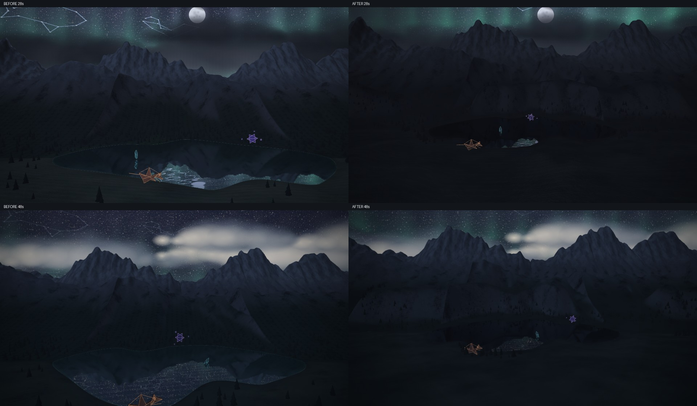

# Journey naturalism evidence

The captures use the deterministic synthetic 60-second pilot (`tools/gen-pilot-wav.mjs`, 112 BPM), song and construction seed `2917029651`. This tests measured calm/energetic/quiet sections, appearance and renderer correctness. It does not establish real-song interpretation or hardware frame rates: the browser uses software WebGL through SwiftShader.

Baseline source is `be8d0c4c0bd33e3839ba2a8b6f154a9e38e0ebef`. Before and after must use the same pilot bytes, seed, times and requested export dimensions. The report hashes each served source/asset response and verifies it against the selected checkout. Natural frames remain separate from explicitly controlled weather fixtures.

Baseline report, aspect/weather montages and motion MP4 are in [`before/`](before/). The baseline square/portrait backing canvases are correct, but their scenic stage remains letterboxed at landscape aspect. The captures make that old stage-aspect mismatch visible separately from the page's UI fit.

Completed after evidence is in [`after/`](after/): eight required times per aspect, matched weather states, main/quiet/controlled-weather motion MP4s, and a compact report. Actual usable square and portrait scenic aspects pass; all five behavioral checks pass under the labeled matched compositor inputs, with no page/shader errors. The full raw reports remain separate; their SHA-256 hashes are included in the compact reports.

The local capture commit is `d93238f552bf67bfc30bc0524460105f5d3235db`. Published source commit `f0c35bb62ae97d5def8027780d95ef0bc9a76794` has the identical Git tree `2228312748fa461c7bec61d0999f5604020b7b9e`. A later delivery commit adds this evidence without changing the captured production bytes. Served-source hashes in the report identify what drew the images.



Review all eight times in the [landscape](after/landscape-montage.jpg), [square](after/square-montage.jpg) and [portrait](after/portrait-montage.jpg) montages, plus [controlled weather](after/weather-montage.jpg). Full-size [landscape 28s](after/landscape-28s.jpg), [landscape 48s](after/landscape-48s.jpg), [portrait 28s](after/portrait-28s.jpg) and [portrait 48s](after/portrait-48s.jpg) retain detailed framing/contact evidence. These review copies use high-quality JPEG; raw PNGs remain with the full capture report and supplied pixel measurements use those raw PNGs.

Motion: [before, 28–32s](before/motion.mp4), [after, 28–32s](after/motion.mp4), [quiet, 9–11s](after/quiet-motion.mp4), [controlled storm/flash/clearing](after/weather-motion.mp4). The last clip is explicitly controlled; it does not claim that this synthetic pilot naturally produced those flashes.

Normal-size review found continuous foreground, a dark night lake with shared reflections, separated mountain ranges, irregular tree groups and a fully framed trio including Broshi at 48 seconds. The night shoreline's prior bright/dashed MSAA seam is gone. Storm-to-flash mean maximum-channel differences at matched 30 seconds are `58.69/255` in the upper half and `39.37/255` in the lower half, versus the baseline's `21.49/255` and `0.013/255`; receivers now respond visibly. This does not imply uniform illumination of every lower pixel. Peak tracked ownership across the sampled aspects was 102.10 MiB under a 256 MiB budget, with zero denials/overcommits. The software renderer results establish ownership/correctness, not device performance.

Limits remain: one synthetic track/seed, no full real-song listening evaluation, and no hardware frame-rate benchmark. The angular trio is deliberately retained; dark foreground occupies substantial portrait space. Existing compositor spring zoom differs on transport reconstruction as described below.

```sh
node tools/gen-pilot-wav.mjs /tmp/journey-pilot.wav 60 112
PLAYWRIGHT_CHROMIUM_PATH=/path/to/chromium node tools/journey-naturalism-evidence.mjs \
  --url http://127.0.0.1:8123 --serve 1 --source-root /path/to/checkout \
  --wav /tmp/journey-pilot.wav --output /tmp/journey-evidence
```

The harness captures 0.25, 9, 22, 28, 30, 32, 48 and 58.5 seconds at 960×540, 720×720 and 540×960. These are requested export stages; they do not rely on the landscape-fit app UI. It also captures a continuous 28–32-second sequence at 15 FPS and matched 30-second clear/storm/flash/reduced-flash/clearing fixtures. Supplementary 13-frame sequences at 6 FPS show quiet locomotion at 9–11 seconds and controlled storm/flash/clearing receivers at 30–32 seconds. The latter weather envelope is an explicit fixture, not the pilot's measured storm schedule. The PNGs are direct stage-canvas renders. The harness sets `hudInFrame=false`; scene-native title/caption behavior is retained (including the natural 9-second title).

For a quick shader/appearance preview, append `--aspects landscape --motion 0`. Omit those flags for the complete matched capture.

For integrated acceptance append `--assert-aspect 1 --probes 1`. Aspect assertions compare the actual usable scenic viewport after overscan against the requested canvas aspect; leave this flag off when reproducing the baseline's old letterboxing. Behavioral probes run before motion capture and exercise backward transport seeking, cold export reconstruction, held-time samples, reduced-motion spatial freezing and a real `WEBGL_lose_context` loss/restore cycle. They compare sampled world/cast/camera state at `1e-7` precision. The labeled probe reference and probe frames pin compositor zoom=1 and roll/shake/float tilt=0 so the Journey camera receives identical viewport inputs; natural frames remain unpinned. Existing compositor zoom springs reconstruct differently on transport seeking, so this proves Journey camera correctness under matched inputs, not whole-output camera determinism. It also does not require whole-canvas pixel equality from compositor finish passes. Context-loss fallback and restored Journey frames are saved separately. These are correctness samples, not live frame-rate measurements. `--aspects landscape --only-probes 1` is a bounded diagnostic run of the same probes without the motion suites.

Each completed frame checkpoints progress. Interrupting the harness preserves the report as incomplete; only a finished run claims the served digest and successful probes.

```sh
ffmpeg -y -framerate 15 -i /tmp/journey-evidence/motion/frame-%03d.png \
  -c:v libx264 -pix_fmt yuv420p -crf 20 /tmp/journey-evidence/motion.mp4
```

Browser setup: Playwright can launch a supported existing `@sparticuz/chromium` package binary with `--use-angle=swiftshader --enable-unsafe-swiftshader --ignore-gpu-blocklist`. No product dependency or production source changes are needed. The exercised browser was Chromium `153.0.8010.0` from package `@sparticuz/chromium@153.0.0`. The Playwright standard browser download was unavailable (future build 1234 returned a corrupt zero-byte ZIP), so this legitimate preinstalled bundle provided the actual browser.
