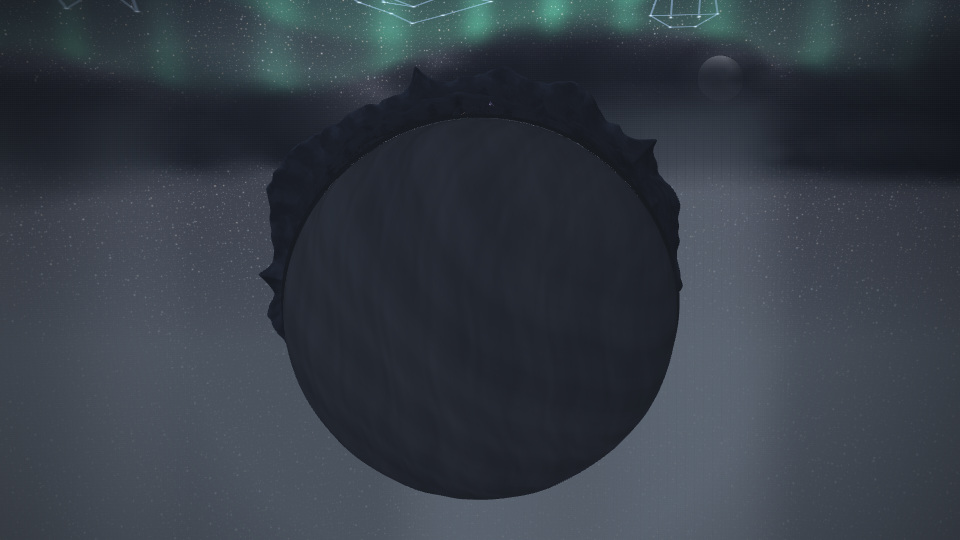

# Circular Journey render evidence

Actual browser captures of the circular Journey, accepted after visual review. The main preview is the night arrival reveal; the contact sheets include the opening, ordinary follow views, and the second reveal.



- [Landscape natural frames](natural-landscape.png): 0.25, 9, 22, 30, and 48 seconds at 960×540.
- [Portrait natural frames](natural-portrait.png): the same times at 540×960, with actual portrait scene framing.
- [Seam contact sheet](seam-contact.png): both aspects immediately before, at, and after one full circumference.
- [Seam motion clip](seam-motion.mp4): 13 landscape frames over two seconds of sampled time, encoded at 6 fps (2.167 seconds).
- Full-size review JPEGs: [landscape follow](landscape-9000ms.jpg), [landscape reveal](landscape-22000ms.jpg), [portrait follow](portrait-9000ms.jpg), [portrait reveal](portrait-22000ms.jpg).
- [Compact report](report.json): source hashes, dimensions, camera, radial projection uniform, sampled cast, render counters, lifecycle checks, and artifact hashes.

The opening and 22-second arrival show a filled circular body with a continuous mountainous rim. Ordinary views follow the cast along the curved shore with a fixed camera orientation. All three principal characters remain in the follow frames. The seam fixtures show continuous local geography and cast through the circumference crossing at 297049.8885 ms.

## Verification and provenance

The run saved 30 frames: ten natural frames, one context-restoration frame, six seam stills, and thirteen clip frames. Every natural frame passed the requested backing dimensions and usable scene aspect checks. Every captured frame had `uJourneyOrbit=1`. No page or shader compilation errors were recorded.

The harness passed CPU reverse-seek and reduced-motion sample equality, a real transport seek with the compositor camera unpinned, matched-input transport seek, and an actual `WEBGL_lose_context` fallback/restoration cycle. Comparisons cover sampled Journey world, cast, and camera, rounded to 1e-7; they do not assert whole-canvas pixel identity. The reduced-motion check covers the pure sampled state/cast/camera, rather than an additional rendered reduced-motion movie.

The capture started from local base `8e54f7c774bca478f7cb0a08fd47c8a92c3e2363` with the integrated working-tree changes listed in the report. After source commit, **all 324 served file hashes were compared successfully** against local source commit `6c6a95bf580c3d4600689569a52425286e6b831e`. Published source commit `dd7ef8cef81e135fb8bd4e2df1a3a3a7147f259b` has the same tree `fe119b1a30e25f6d45f0795f5f2ceb6c8f1d3b27`. The served-file digest is `4c1f425f22c8277fd89b85e3bf905a396580ee3655866a90dfcef4ef377b571d`. The later evidence commit adds this package; the harness is included in the source commit.

The integration owner reported the full source suite: 3947 tests, 3942 passed, 0 failed, 5 skipped; lint and site staging passed. This evidence task did not repeat that suite. The new capture tool passed syntax and targeted lint checks before this run.

## Scope and reproduction

The natural frames use the deterministic 60-second synthetic pilot (112 BPM, seed 2917029651), the actual application export clock, HUD disabled, and retained scene-native title/caption behavior. They were rendered by Chromium 153.0.8010.0 using SwiftShader. Per-frame counters stayed at 38 draw calls, 856617 triangles, and four submissions. These are scene counters, not hardware frame-rate measurements or evidence of playback smoothness on a user's GPU.

The pilot cannot naturally reach the circumference crossing near 297 seconds. The explicitly labeled direct-scene fixture reuses a prepared 30-second application frame, preserving its music/light inputs while overriding scene time, duration, and reveal. It renders Journey sky and land directly into an offscreen canvas; it omits the application compositor finish/HUD. The seam clip has no audio and is not an analysis of a real five-minute song. It provides local render continuity evidence at the wrap, not a long-duration playback benchmark.

Run from the repository root, with a compatible Chromium path and the synthetic pilot available:

```sh
PLAYWRIGHT_CHROMIUM_PATH=/path/to/chromium node tools/journey-orbit-evidence.mjs \
  --url http://127.0.0.1:8125 --serve 1 --source-root "$PWD" \
  --wav /path/to/journey-pilot.wav --output /path/to/orbit-evidence
```

The full PNGs, 13 clip input PNGs, and raw report remain in the capture workspace at `/workspace/scratch/bb59e08d35c7/journey-evidence/orbit-final`. The raw report SHA-256 is `1ae7f8ecbf5adeb4613630d30acbf0824317eb4ddb88539a3fbd2b50e92c8254`; committed review images are resized PNG contact sheets and high-quality JPEG keyframes, with the original PNG hashes recorded in the compact report.
