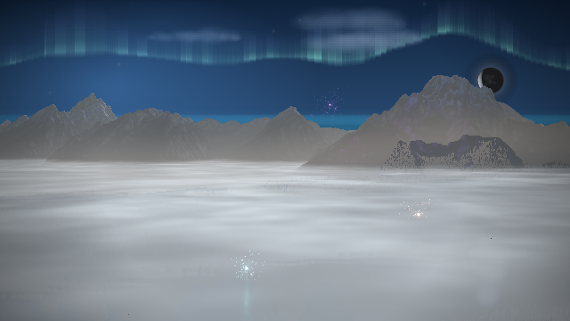
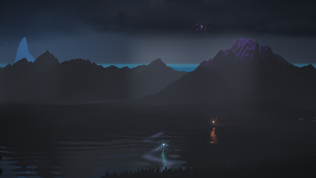
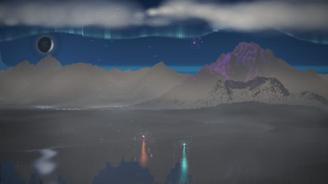

# The Range's moonlit day

Production compositor captures from a generated 60-second song, with the
approved Teton view and CONIFER biome fixed for comparison. The moon rises
from the right, passes overhead, and sets on the left. The overhead frame
also contains the song's storm; weather and camera continue their normal
musical behavior.

| Rising — 12 s | Overhead — 30 s | Setting — 48 s |
| --- | --- | --- |
|  |  |  |

[Resolved lighting and source hashes](summary.json) confirm night=1, no
direct sunlight, the moon as the active light, and no twilight washes at all
three times. The moon uses the existing approached celestial path, which can
carry the disc above the visible frame when overhead. Reflections, terrain
and atmosphere retain its shared light anchor.

Validation: 3,915 tests passed, zero failed; lint and diff checks passed.
Independent code review found no actionable issues. All three browser frames
used v2 with no page or shader errors. These are synthetic-audio captures on
Chromium software WebGL, not hardware performance measurements.

Reproduce with the app served on port 8092:

```
PLAYWRIGHT_CHROMIUM_PATH=/usr/bin/chromium node tools/moon-cycle-evidence.mjs
```
