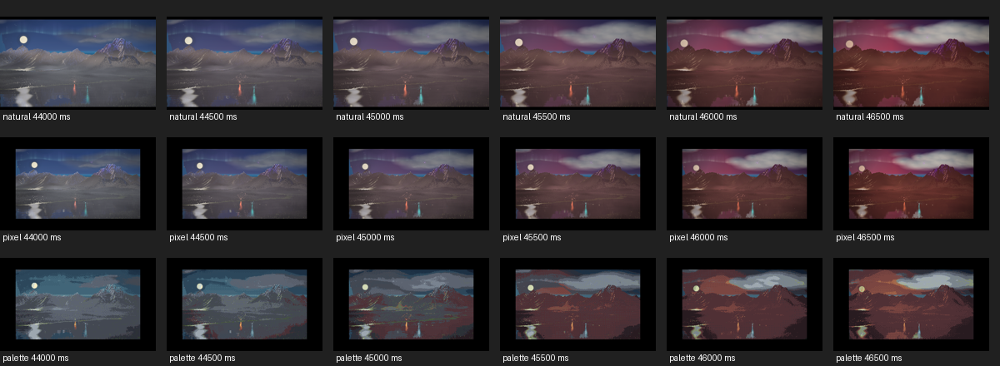

# Pixel repair follow-up evidence

The original evidence remains in the parent directory. This supplement adds 18 matched Natural/Pixel/Palette frames at 44–46.5 seconds, generated contrast audio (60 seconds), fixed seed 315, 800×480 output, DPR 1, Economy/Integer. Each image is a completed active Range v2 frame. The manifest includes source commit/hash, requested/effective presentation, camera controls, palette state, dimensions, backend state and PNG hashes. These are post-repair camera-motion captures, not a new before/after aesthetic change.

Inspection: the Tetons silhouette and lake remain coherent through the authored finale dolly/crane and changing light. Pixel preserves the same composition on its fixed 320×180 grid with 640×360 placement. Palette visibly quantizes the sky/water and dither while keeping the landmarks. These frames contain no actor cast or in-frame text; they do not establish those visual acceptance cases. The original evidence separately covers in-frame text. No scene redesign was made.

[Download full frames, audio, manifests and diagnostic results](followup-evidence.zip). Archive SHA-256: `e4f0db79a39f7d0e9e622034ce13e868550d828824509a8f8a97a6171aa954d4`. Every PNG hash was verified before packaging.

The complete visual baseline/repeat/comparison corpus passed all three fixture shards in [run 38041246054](https://github.com/aepler315/Midio-5/actions/runs/38041246054); [landscape](https://github.com/aepler315/Midio-5/actions/runs/38041246055) and [unit/browser](https://github.com/aepler315/Midio-5/actions/runs/38041246013) also passed. The original unsharded repeat job exceeded its 30-minute timeout; PR #423 changes only scheduling and preserves the full corpus.

The archive also contains a real Chromium invalid-GLSL/clipboard diagnostic test and the failed live v2 recording probe log. The v2 recording timed out waiting for download and is **not an encode/decode pass**. Original legacy live Pixel/Palette H.264 encode/decode tests passed. SwiftShader results are not hardware benchmarks or S26 Ultra compatibility verification.

The S26 Ultra Chrome report of persistent flat scenery on superMaudio.com remains unresolved. Deployed presentation modules match merged code, and all 13 deployed terrain manifests/payload hashes checked correctly. An emulated mobile-budget playback did transition to active 3D, so permanent failure was not reproduced. PR #424 adds a local copyable graphics report and preserves native compiler errors to collect the actual phone failure. After that change is deployed, open Display → Graphics troubleshooting → Copy graphics report on the phone and paste the report in the conversation. No audio, filenames or lyrics are included, and no report is sent automatically.
