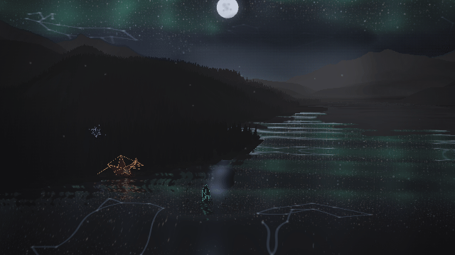

# Living Range sky and cove

This follow-up replaces the performance view’s cropped Canvas reflection with a shared directional sky. Seeded twinkling stars, illustrated constellations, and sustained aurora curtains exist above the visible frame as well as within it. The lake samples the same field along reflected rays; its terrain and resident reflections keep the real mirror pass. Sunset, moonlight, and sunrise remain the show’s lighting sequence.

The residents have independent idle motion with musical emphasis. Midio floats inside the wet cove, Broshi articulates his head and tail with planted feet, and Midasus wanders above the bank. Silence still suppresses musical light and water impulses. Reduced motion freezes the residents and sky motion; reduced flash attenuates modulation.

## Reproduce

```sh
node tools/serve.js 8093
PLAYWRIGHT_CHROMIUM_PATH=/usr/bin/chromium node tools/range-performance-evidence.mjs http://127.0.0.1:8093 .smoke/range-living-sky
npm test
npm run lint
```

The browser harness uses the actual application, synthetic WAV analysis, geographic terrain, and final Canvas compositor. It verifies served source hashes and records renderer errors, seek reconstruction, held poses, reduced motion, and portrait export. The animated preview spans eight seconds of heard time at 2.5 frames per second.

Layer toggles at the same held frame isolate stars, constellation art, and aurora in the upper sky and lower lake. Reflected water rays are projected back through the camera to verify that the sampled sky lies above the viewport. Individual pose substitutions at one fixed camera/time prove that each resident changes visible pixels, including its real reflection.

At 640 × 360, the checks recorded 3,403 visible star pixels overhead and 8,437 in the lower lake; 881 constellation-art pixels overhead and 2,028 in the lower lake. All those lower-lake samples reflected directions above the viewport. Isolated resident motion changed 445 pixels for Midio, 415 for Broshi, and 259 for Midasus.

Full suite: 3,816 tests passed. Browser evidence uses Chromium with software WebGL; hardware frame-rate performance is unmeasured.



Still frames: [sunset](sunset.png), [moonlight](moonlight.png), [sunrise](sunrise.png), [portrait](portrait.png). Exact diagnostics and source hashes: [report.json](report.json).
