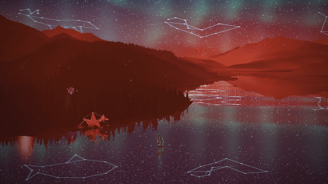

# Gradual twilight

The sunset sequence uses the actual Range renderer and audio-analysis/export path at 640 × 360. Pink afterglow remains during moonrise, passes through violet and blue, then settles into cool moonlight. The lake and distant landscape use the same color state. Sunrise reverses that progression.

On the 60-second pilot, afterglow strength falls gradually from 0.987 at one second to 0.648 at six seconds, 0.352 at nine seconds, 0.104 at twelve seconds, and zero at fifteen seconds. Longer tracks allow up to 45 seconds of afterglow. The sun and moon keep their existing orbits.

The harness verifies afterglow during moonrise, held and backward-seek color reconstruction, served source hashes, the active directional sky, and browser diagnostics. Unit checks also bound color changes across sunset, moonrise and sunrise, and prevent a warm pale biome from washing the night sky into beige. All 3,821 suite tests and lint pass. Evidence uses synthetic audio and software WebGL; hardware performance is unmeasured.

```sh
PLAYWRIGHT_CHROMIUM_PATH=/usr/bin/chromium node tools/range-twilight-evidence.mjs http://127.0.0.1:8093 .smoke/range-twilight
```



Still frames: [rose](rose.png), [violet](violet.png), [blue](blue.png), [moonlight](moonlight.png), [sunrise](sunrise.png). [Exact diagnostics and source hashes](report.json).
