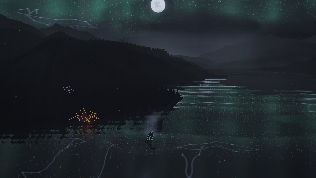

# Musical movement in the cove

The residents now physically answer the current musical accents. Midio swims and dips, Broshi articulates his head and tail around his grounded root, and Midasus traces wider melodic arcs with circling companions. The aurora retains its sustained light while current rhythm, bass and melody displace its folds. The lake reflects that same directional field, with stronger musical disturbances; performance terrain accents retain the existing geological cap.

The moonlit palette, gradual twilight, dense stars, constellation artwork and geographic cove remain in place.

## Reproduce

```sh
node tools/serve.js 8093
PLAYWRIGHT_CHROMIUM_PATH=/usr/bin/chromium node tools/range-energy-evidence.mjs http://127.0.0.1:8093 .smoke/range-energy
npm test
npm run lint
```

The harness loads a real synthetic WAV through the application's analysis and export paths. Its 12 fps animation covers 30–34 seconds of the song; the MP4 includes that exact audio interval. The GIF is silent. Browser errors, served source hashes, pause/seek reconstruction and reduced motion are checked.

At one fixed camera, the new poses produce 4.1–7.1 times the old version's projected travel over four seconds of the same analyzed energetic passage. This is a pose diagnostic, using an articulated point one body height above each root; it excludes camera movement. The energetic passage also produces 2.0–6.4 times the travel of the new version's calm passage.

An independent final-pixel check substitutes only one resident's pose 160 milliseconds later, retaining the original camera, clock, lighting and glow. At 640 × 360 it changes 411 pixels for Midio, 486 for Broshi and 180 for Midasus. A separate fixed-time curtain music toggle changes 17,196 pixels in the upper sky and 29,864 in the lower lake. These checks establish spatial movement rather than passing a brightness-only response as animation.

Full suite: 3,824 tests pass; lint passes. Tests include causal response within 160 milliseconds and sampling the real terrain throughout the enlarged paths. Evidence uses software WebGL; hardware frame rate is unmeasured.



[Preview with sound](musical-energy.mp4) · [Still](moonlight.png) · [Diagnostics](report.json)
