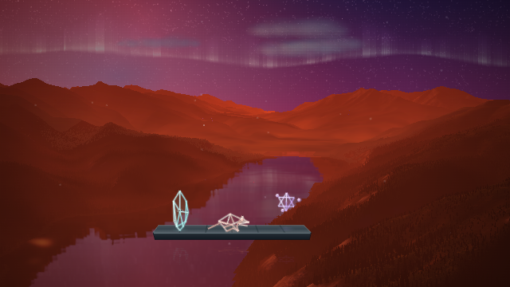
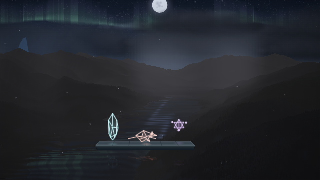
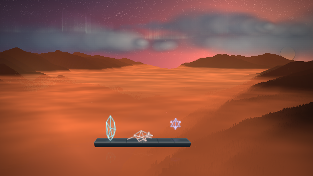

# Range trio performance

The default Range presentation is a steady lateral 3D view of Muncho Lake,
with Midio, Broshi and Midasus on a small foreground platform. The real
terrain, lake mask and terrain reflections retain ownership of the scenery.
The platform and luminous figures use the retained mesh kit and draw directly
into the main composition before its finish and captions.

Midio reads rhythm and lead material, Broshi reads bass, and Midasus reads
melody. Their poses come from the canonical heard-time history, including
MIDI role fallbacks, recording pitch confidence, physical silence and late
analysis handoffs. They settle in silence and remain visible. No gameplay
simulation or performer capture surface is required.

The song begins at sunset, passes through moonlight, and ends at sunrise.
Stars retain a one-output-pixel core when the picture is fitted into small
screens; their catalogue and twinkle remain unchanged. The aurora retains
more of their contrast through its translucent curtain. Real
water receives short musical rings at a verified hydroflattened sample.
Recording noise is filtered at contact onset before the contact limit, so
false detections cannot displace audible rings releasing into silence.

| Sunset — 1 s | Moonlight — 30 s | Sunrise — 59.5 s |
| --- | --- | --- |
|  |  |  |

The [portrait output](trio-portrait.png) uses the same fitted composition.
Reduced motion freezes the camera, hops, body turns and star orbits while
retaining the figures. Reduced flash softens their changing light and lake
response. Explicit scene choices remain respected; `?rangeExperience=landscape`
selects the previous scenery-only presentation.

[Capture results](summary.json) record served source hashes, actual active
renderer and view, fixed camera direction, musical actor activity, real lake
uniforms, seeking, held-time stage repeatability, accessibility, portrait fit,
and star-on/off pixel differences through the final scene. The test uses the
default selection without a `rangeView` override. It checks that stronger bass
in the synthetic song changes Broshi's response and reaches the lake shader.

Independent music and camera reviews found one lake silence defect; its fix
and exact water-sample anchor were reviewed again with no remaining blockers.
Tests also cover isolated rhythm/bass/melody, untrusted synthetic pitch,
maximum zoom safety, reflection and sky camera parity, and other worlds.

Validation: **3,784 tests passed, zero failures; lint and diff checks passed.**
The final upper-sky comparison detects 1,049 visible star pixels at 640-wide
and 1,257 at 360-wide, spanning all four sky columns through the complete
compositor, including the aurora and storm.

These are synthetic-audio captures in Chromium software WebGL. They verify
the production composition and export behavior; device frame rate remains
unmeasured.

Reproduce from the repository root with the app served on port 8093:

```sh
PLAYWRIGHT_CHROMIUM_PATH=/usr/bin/chromium node tools/range-performance-evidence.mjs
```
