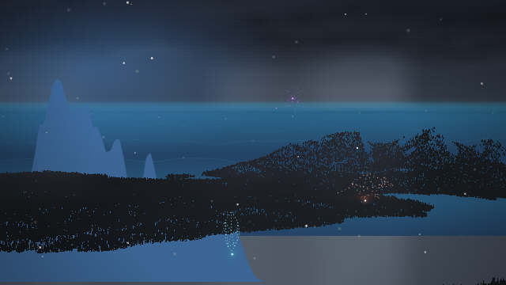
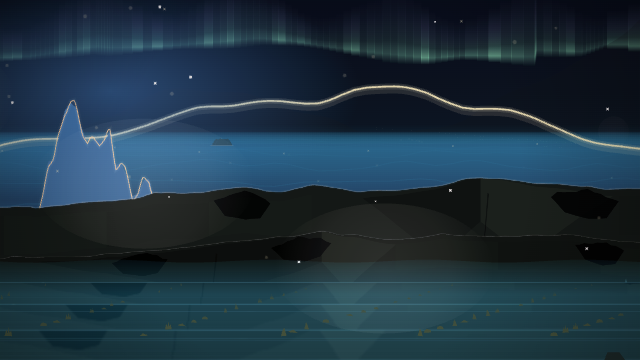

# Terrain shader rejection

The user reported persistent flat terrain and a large blue wedge on
supermaudio.com across songs. The actual device/browser and deployed shader
error are unconfirmed; network policy blocked inspection of the live site.

The generated `contrast` fixture at **12,000 ms**, Jackson Lake, seed 315,
640×360 in Chromium/SwiftShader reproduces the exposed trees and blue wedge
when invalid GLSL is injected into the actual terrain fragment shader.
Three links the program unsuccessfully but `compile()` returns normally.
Before this change the scene still publishes and suppresses legacy terrain.



The candidate checks native program link status before publication. The same
compiler rejection now selects the complete legacy scenery, records a
`shader` failure, and removes the rejected view and its tracked CPU, material,
and GPU reservations. This is a fallback fix, not confirmation that the user's
GPU now renders the physical terrain. Native shader deletion still follows
the pinned Three runtime's disposal/garbage-collection behavior.



Retain: the failed scene no longer leaves unoccluded trees and ocean behind.
The normal scene at **6,000, 12,000, and 20,000 ms** is visually inspected and
has byte-identical PNGs to the baseline. The comparison's automated verdict
remains `unreviewed`; this note records the human-facing retain decision.
No musical timing or shading was changed. The diagnostic audio is generated;
the user's actual songs and hardware have not been tested.

Validation: real compiler-rejection smoke passed after failing on the original
`active === true` behavior; 3,862 unit tests, lint, and site staging passed.
Read-only code review found no blocking issues.

Reproduce after starting `npm run dev`:

```sh
PLAYWRIGHT_CHROMIUM_PATH=/usr/bin/chromium node tools/range-shader-failure-smoke.mjs http://127.0.0.1:8080 .smoke/shader-rejection
```

The command generates a 24-second WAV by default; pass a WAV as the fourth
argument to choose audio. The captured evidence here uses the visual
evaluation `contrast` fixture. Full local normal-scene reports and matching
audio are preserved under `.smoke/range-regression/{baseline,candidate,comparison}`.
