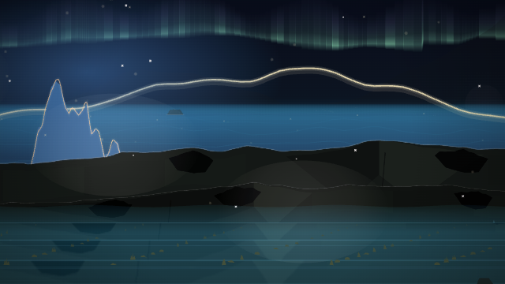
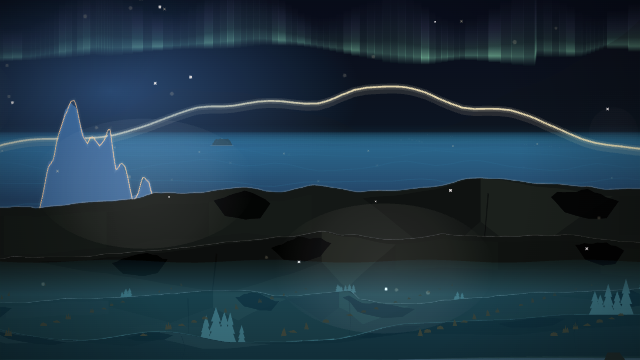

# Foreground ground removal

Generated `contrast` audio, seed 315, 640×360, **12,000 ms** in Chromium
SwiftShader, with `rangeRenderer=legacy`, `rangeTour=off`, and Conifer pinned:





Retain: the ground fill, footing, striped surface, and painted ground
receivers no longer cover the scene. The 3D rock stage is also disabled,
including saved ledge metadata and uncomposed tour views. GroundField
physics remains available. Missing composition metadata retains its former
scenic ownership so tour weather and foreground ambience are not removed
as a side effect.

Cathode's runtime and chooser entry were already deleted on the base
branch. The stale source comment is removed; retirement tests still protect
old saved selections, which normalize to Range. Historical evidence and
regression tests referencing the retired name are retained.

Local evidence, including copied diagnostic audio and exact source snapshots,
is preserved in `.smoke/remove-ground`. The normal Jackson Lake baseline
and final candidate use the identical manifest, at **6,000 and 12,000 ms**.
The older coherent-view baseline failed due to an existing terrain-manifest
ID mismatch; that failure is preserved separately and not counted as passing
visual evidence. These are software-browser checks, not a mobile GPU test.

Reproduce the normal capture:

```sh
PLAYWRIGHT_CHROMIUM_PATH=/usr/bin/chromium npm run visual:eval -- --manifest .smoke/remove-ground/manifest.json --out .smoke/remove-ground/new-run
```

Fallback images use the same generated audio through `openSong` and
`captureFrame` from `tools/range-scene-smoke.mjs` with the flags above.
The capture helper and reports are preserved with the local evidence.

Final validation: 3,865 tests, lint, and site staging passed. Both normal 3D
frames are byte-identical to baseline; the fallback images show the intended
removal. The automated comparison remains `unreviewed`; this note records
the visual retain decision. Code review found no remaining blocking issues.
