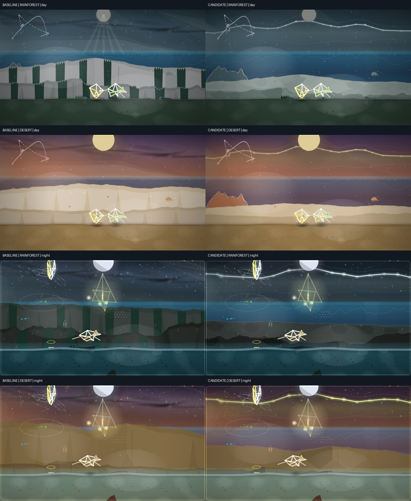
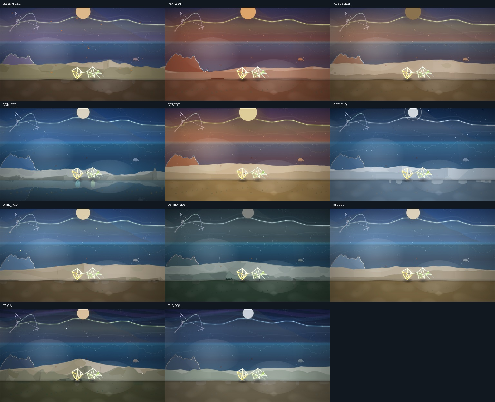
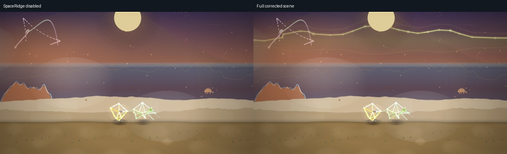

# Range visual correction — validation

Base: `3231263e8d1a624f8f78421ed46ee70bc7770061` (main after #329).
The implementation was recovered from an interrupted CLI session and checked
against a fresh checkout of that exact base. The original user screenshot and
session logs are not repository assets.

## Visual comparison

The corrected scene restores a broad, filled, music-responsive SpaceRidge
behind the celestial bodies. Generic stars and incidental figures yield its
corridor. The scenic ranges retain their real source contours, while lower,
fixed per-biome fits leave the musical horizon exposed. Forest and dry faces
retain intrinsic shading; distant vegetation receives the same atmospheric
depth as the ridge carrying it. Ground response and performer identity remain.





The initial recovered candidate was not accepted: it retained gray forest
highlights, dark cover patches, and overly shallow ranges. Live canvas probes
identified repeated saturation removal and a 64px ground-coordinate error in
the fitter. Regression tests and fresh captures validate those corrections.
Independent review also caught an exhausted-dominant edge case in visibility
fitting. A dedicated regression now proves that another actual blocker yields
when the first reaches its minimum. All review findings are resolved.



[Ten-second travel clip](evidence/range-20260926/travel-motion.mp4) ·
[Capture provenance and metrics](evidence/range-20260926/manifest.json)

## Evidence contract

Captures use Chromium 153, a deterministic generated 96-second WAV, construction
seed 315, and explicit real-range fixtures. Construction seed and actual song
seed are distinct and recorded separately. The harness checks actual range IDs,
clock, DPR, and served module hashes before and after each completed run.
Candidate captures intentionally record the dirty working tree at the base SHA;
the module hashes, rather than that SHA alone, identify the implementation.

The accepted matrix has 36 candidate cases and 36 matched baseline cases.
Candidate full, visibility, and motion runs finished without page errors.

| Check | Result |
| --- | --- |
| All 11 biomes, normal view | Horizon 100%; minimum L2 crest exposure 62.11% |
| Tilted pullback at zoom 0.72 | Horizon 100%; L2 crest exposure 57.85% |
| 21 broad-profile stations | Horizon 100%; minimum L2 crest exposure 64.29% |
| Full-matrix foreground area | Maximum L3 14.38%; L4 1.99% of viewport |
| Motion | 120 distinct frames at 12 fps, from 18.000s through 27.917s |
| World playback | All nine worlds completed selection, passage, rhythm, seek and reduced-motion assertions across resumed runs |

The 21 broad-profile stations are distinct captures from 5s through 85s. Across
them the musical horizon is fully exposed, L2 crest exposure is at least 64.29%,
and L3 body area above the actual ground never exceeds 15.75% of the viewport.
These are fixture results, not guarantees for every song or terrain choice.

Moving-seam fixtures assert that L2–L5 actually invoke the travel compositor at
25%, 50%, and 75%. Earlier dissolve-only captures are excluded. Pullback sets
both zoom and the corresponding layer tilt. Scenic masks are recorded after
that tilt, only during painting; diagnostic recomputation cannot overwrite them.
Transition frames report side geometry without claiming both entire sides are
simultaneously visible. Body area is unavailable when the ground-interior pass
does not paint (for example, a liquid-ground case); no zero is substituted.

The first full baseline run stopped after 33 captures because the portable
browser's single-process mode could not replace a browser context. The flag was
removed from the local runner; real seam, viewport, and tilted-pullback cases
were then captured in completed supplementary runs. Baseline source remained
unchanged. No portable-browser package was added to the product dependencies.

The full matrix exposed an ICEFIELD failure hidden by the fitter's original
10th-percentile test. Fitting now checks every sampled station. Full and motion
captures were repeated after that correction. Their source hashes precede the
final exhausted-dominant fallback; a fresh browser probe verified identical fit
coefficients and visibility metrics for all eleven fixtures after the fallback.
The earlier 21-station CANYON run retains its own hash: its fit coefficients are
unchanged by either correction. The manifest preserves these distinct snapshots
instead of relabeling them as one revision.

The clip was checked using sampled frames and frame differences. Terrain moves
through the A/B seam without a transparent overlap. The largest pixel delta at
24.083s is a brief full-scene landing/accent flash, not a terrain discontinuity.
Reduced-flash presence is covered separately by matrix cases and unit tests.

World smoke runs resumed after software rendering skipped a narrow live-clock
window. The harness now pauses after actual live rhythm has advanced, then seeks
synchronously using audio time (simulation time includes a 52ms visual lead).
The first three successful world records are retained from the earlier run;
six worlds completed with the corrected harness. All nine have no page errors.

## Verification

- `npm test`: 3,225 passed, zero failures.
- `npm run lint`: passed.
- `npm run stage:site`: passed.
- `npm audit`: zero vulnerabilities.
- Whole-branch review: blockers resolved; no new findings on follow-up.

The independent reviewer reran all 13 composition tests after the final fix
and reported no remaining findings. The change introduces no dependencies.

## Reproduce

Start `node tools/serve.js 8090` from the revision to inspect, then run the
candidate harness with explicit source identity:

```sh
node tools/range-landscape-smoke.mjs \
  --url http://127.0.0.1:8090 \
  --source-root . \
  --expect-sha "$(git rev-parse HEAD)" \
  --preset full --output .smoke/range-full --stage candidate
```

Repeat with `--preset visibility` and `--preset motion` in separate output
directories. For a historical comparison, serve a clean baseline checkout and
point the current harness at that checkout's URL, source root, and SHA. Use the
same generated WAV, fixture definitions, browser, and viewport settings.

The motion capture measures deterministic rendered continuity. Headless draw
submission timings are not device FPS, GPU timings, or a performance guarantee.
SpaceRidge's monolith connection deliberately meets its fixed underside, below
the moving musical crest.
